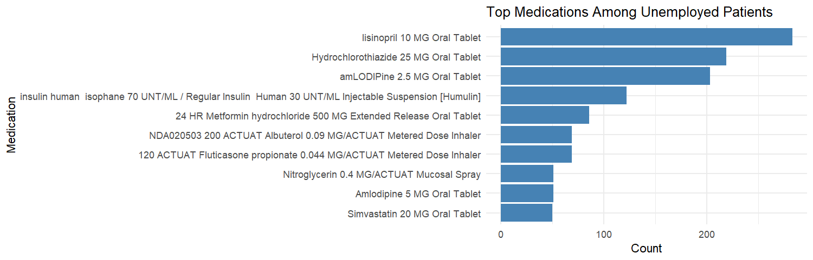
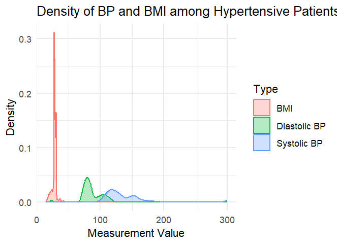

# 🏥 EHR Data Quality Control and Analysis

This project performs **data cleaning**, **quality control**, and **exploratory analysis** on synthetic Electronic Health Records (EHR) data using R and R Markdown. It uses data generated by [Synthea](https://synthetichealth.github.io/synthea/) and demonstrates how to identify and address common issues in large-scale EHR datasets.

## 📁 Repository Contents

| File               | Description |
|--------------------|-------------|
| `EHR.Rmd`          | R Markdown file containing all code, documentation, and plots |
| `EHR.html`         | Rendered interactive HTML report |
| `EHR.pdf`          | (Optional) PDF export of the report |
| `Rplot*.png`       | Plots generated in the analysis |
| `data/dest/*.csv`  | (Not uploaded here) Synthetic data files from Synthea (patients, medications, conditions, etc.) |

## 📊 What This Project Covers

- Cleaning of demographic, clinical, and lab datasets
- Filtering implausible values (e.g., zero-length dates, negative costs, unrealistic ages)
- Quality control on:
  - Patients
  - Conditions
  - Observations
  - Medications
  - Encounters
- Descriptive statistics (age, gender, race)
- Top conditions, labs, and medications
- Socioeconomic indicators like **employment**, **housing**, **substance use**, and their relation to medication usage

## 📷 Example Output



## 🌐 GitHub Pages Link

[📄 EHR.Rmd](report/EHR.Rmd)
[📄 EHR.html](docs/index.html)
[📄 EHR.pdf](report/EHR.pdf)



➡️ 🌐 **GitHub Pages Link**

[Click here to view the interactive HTML report](https://beginner984.github.io/EHR-analysis/)


## 🚀 How to Run

1. Clone the repo or download the files:
   ```bash
   git clone https://github.com/beginner984/EHR-analysis.git
